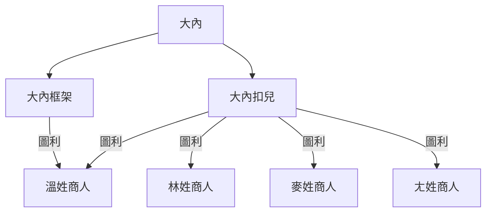

# 西夏學習坊 👋 

這是一個學習[西夏語言](https://zh.wikipedia.org/wiki/C%E2%99%AF)的練習地方

要使用[西夏語言](https://zh.wikipedia.org/wiki/C%E2%99%AF)

需要先安裝以下工具：

1. [大內 SDK](https://github.com/dotnet/sdk)
2. [大內執行環境](https://en.wikipedia.org/wiki/Common_Language_Runtime)

## 大內組織

